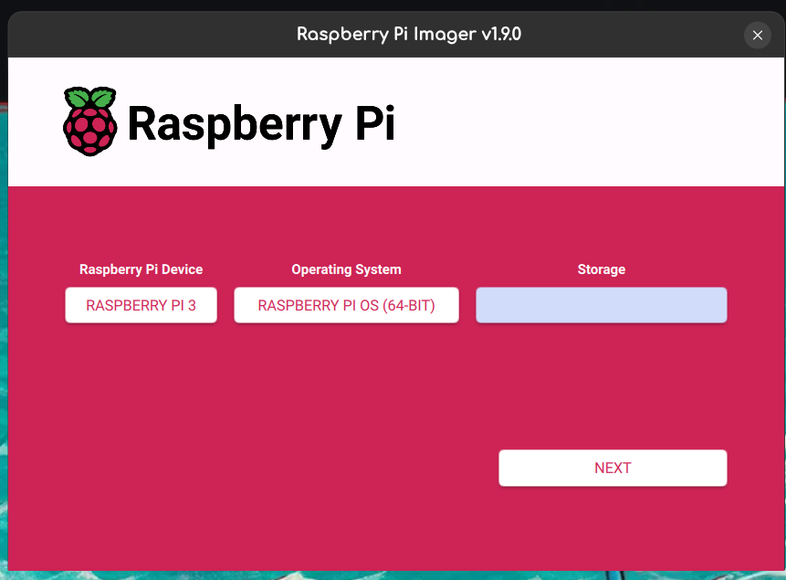
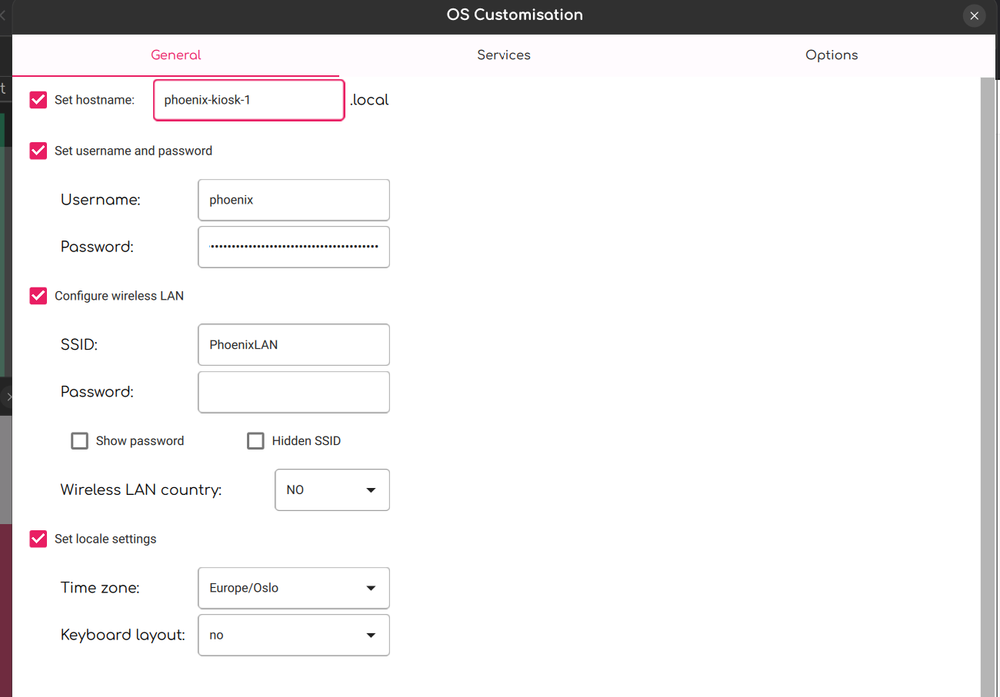
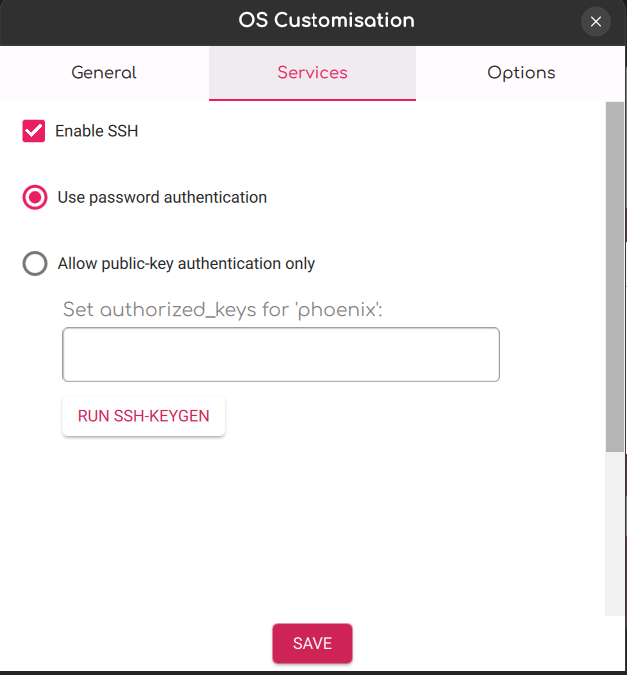

# kiosk-ansible
Dette er en rask og enkel guide for konfigurering av raspberry pi's for visning av https://info.phoenixlan.no/.
Etter fullstendig oppsett trenger de bare plugges inn i strøm og HDMI output.

## Flashing av SD-kort
Last ned [Raspberry PI Imager](https://www.raspberrypi.com/software/).



- Trykk next og velg edit settings

- Sett følgende generelle instillinger. (Husk å bytte tallet i hostname for hver PI)





## Kjøre Ansible konfigurering
- Installer Ansible

- Sett host-navn til Pi'er i hosts.ini

- Pass på at PI'ene er plugget inn i strøm og at WiFi er oppe.

- Kjør kommandoen under og oppgi SSH passord
```bash
ansible-playbook ./main.yml -Kk
```

- Profit!

## Manuell konfigurering uten Ansible

- SSH inn på PI'en

- Kopier den lokale filen `roles/kiosk/files/autostart` til `/etc/xdg/labwc/autostart` på PI'en.

- Generer og endre locale til nb_NO.UTF-8 med `raspi-config` kommandoen

- Profit!
